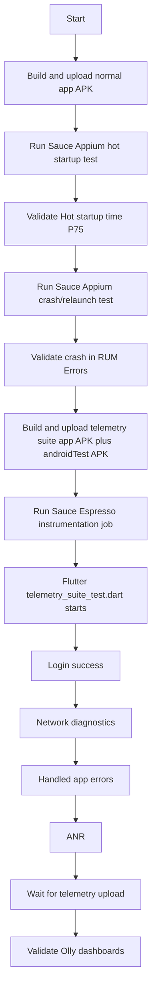

# Sauce Labs Telemetry Testing Guide

This document explains the Splunk RUM SDK versions, APK artifacts, Sauce Labs
uploads, test commands, and recommended execution order for the SmartCinema root
example app.

## 1. Current SDK Versions

The project currently uses these Splunk versions:

| Component | Current version | Where to check |
| --- | --- | --- |
| Flutter RUM package | `1.0.1` | `packages/splunk_otel_flutter/splunk_otel_flutter/pubspec.yaml` |
| Flutter Session Replay package | `1.0.1` | `packages/splunk_otel_flutter_session_replay/splunk_otel_flutter_session_replay/pubspec.yaml` |
| Native Android Splunk RUM SDK | `2.2.2` | `packages/splunk_otel_flutter/splunk_otel_flutter/android/gradle.properties` |
| Native Android Session Replay SDK | `2.2.2` | `packages/splunk_otel_flutter_session_replay/splunk_otel_flutter_session_replay/android/gradle.properties` |
| Android auto-instrumentation Gradle plugins | `2.2.2` | `splunk_otel_flutter_root_example_app/android/app/build.gradle.kts` |
| Root example app version | `1.0.0+1` | `splunk_otel_flutter_root_example_app/pubspec.yaml` |

Useful commands:

```bash
rg "version:|splunkSdkVersion|rum-okhttp3-auto-plugin|rum-httpurlconnection-auto-plugin" \
  packages/splunk_otel_flutter/splunk_otel_flutter/pubspec.yaml \
  packages/splunk_otel_flutter/splunk_otel_flutter/android/gradle.properties \
  packages/splunk_otel_flutter_session_replay/splunk_otel_flutter_session_replay/pubspec.yaml \
  packages/splunk_otel_flutter_session_replay/splunk_otel_flutter_session_replay/android/gradle.properties \
  splunk_otel_flutter_root_example_app/android/app/build.gradle.kts
```

Runtime verification:

```bash
rg "rum.sdk.version|rum.sdk.flutter.version|app.version" build/*.log
```

Expected runtime resource values include:

```text
rum.sdk.version=2.2.2
rum.sdk.flutter.version=1.0.1
app.version=1.0.0
```

## 2. APK Files To Upload To Sauce Labs

There are two different Sauce artifact patterns. Use the right one for the test
type.

### A. Normal App APK For Appium Tests

Use this for Appium jobs that drive the app from outside the app process:

- Hot startup test
- Bad-email crash/relaunch test

Artifact:

```text
build/app/outputs/flutter-apk/app-debug.apk
```

Build and upload:

```bash
cd splunk_otel_flutter_root_example_app

REALM=mon0 \
RUM_ACCESS_TOKEN=<rum-token> \
SAUCE_USERNAME=<sauce-user> \
SAUCE_ACCESS_KEY=<sauce-key> \
SAUCE_REGION=us-west-1 \
SAUCE_APP_NAME=smart-cinema-appium.apk \
./tool/build_and_upload_sauce_apk.sh
```

Sauce capability:

```yaml
app: storage:filename=smart-cinema-appium.apk
```

You can also use the returned Sauce file id:

```yaml
app: storage:<file-id>
```

### B. Flutter Integration / Android Instrumentation APK Pair

Use this for Flutter `integration_test` runs on Sauce via Android
instrumentation/Espresso.

Artifacts:

```text
build/app/outputs/flutter-apk/app-debug.apk
build/app/outputs/apk/androidTest/debug/app-debug-androidTest.apk
```

The first APK is the app APK compiled with the Flutter integration test target.
The second APK is the Android instrumentation test APK that uses
`FlutterTestRunner`.

Build and upload the full telemetry suite:

```bash
cd splunk_otel_flutter_root_example_app

REALM=mon0 \
RUM_ACCESS_TOKEN=<rum-token> \
SAUCE_USERNAME=<sauce-user> \
SAUCE_ACCESS_KEY=<sauce-key> \
SAUCE_REGION=us-west-1 \
TEST_TARGET=integration_test/telemetry_suite_test.dart \
SAUCE_APP_NAME=smart-cinema-telemetry-suite.apk \
SAUCE_TEST_APP_NAME=smart-cinema-telemetry-suite-test.apk \
./tool/build_and_upload_sauce_anr_test_apk.sh
```

Sauce/Espresso capabilities:

```yaml
espresso:
  app: storage:filename=smart-cinema-telemetry-suite.apk
  testApp: storage:filename=smart-cinema-telemetry-suite-test.apk
```

Important: `build_and_upload_sauce_anr_test_apk.sh` has an ANR-oriented name
because it was created for the first instrumentation flow. Set `TEST_TARGET` to
`integration_test/telemetry_suite_test.dart` to run the full suite.

Do not upload a Dart file to Sauce. Sauce needs APK artifacts.

## 3. Tests And Commands

### Recommended Sauce Labs Tests

#### 1. Telemetry Suite

Test file:

```text
integration_test/telemetry_suite_test.dart
```

Runs:

- Successful login telemetry
- Native network request telemetry
- Handled app errors
- ANR telemetry

Local emulator command:

```bash
cd splunk_otel_flutter_root_example_app

flutter test integration_test/telemetry_suite_test.dart -d emulator-5554 \
  --dart-define=REALM=mon0 \
  --dart-define=RUM_ACCESS_TOKEN=<rum-token> \
  --dart-define=APP_ERROR_COUNT=3 \
  --dart-define=TELEMETRY_SETTLE_SECONDS=90
```

Sauce upload command:

```bash
REALM=mon0 \
RUM_ACCESS_TOKEN=<rum-token> \
SAUCE_USERNAME=<sauce-user> \
SAUCE_ACCESS_KEY=<sauce-key> \
TEST_TARGET=integration_test/telemetry_suite_test.dart \
SAUCE_APP_NAME=smart-cinema-telemetry-suite.apk \
SAUCE_TEST_APP_NAME=smart-cinema-telemetry-suite-test.apk \
./tool/build_and_upload_sauce_anr_test_apk.sh
```

Sauce execution:

Use an Espresso/Android instrumentation job with:

```yaml
app: storage:filename=smart-cinema-telemetry-suite.apk
testApp: storage:filename=smart-cinema-telemetry-suite-test.apk
testOptions:
  class:
    - com.splunk.rum.flutter.root.exampleapp.root_example_app.MainActivityTest
```

#### 2. Hot Startup Test

Test file:

```text
appium-crash/hot_startup.mjs
```

Runs outside the app with Appium. It launches the app, waits for initialization,
backgrounds the app, brings it to foreground, waits for telemetry upload, and
saves logcat.

Local emulator command:

```bash
cd splunk_otel_flutter_root_example_app

REALM=mon0 \
RUM_ACCESS_TOKEN=<rum-token> \
DEVICE_ID=emulator-5554 \
./tool/run_hot_startup_test.sh
```

Sauce command:

```bash
cd splunk_otel_flutter_root_example_app

SAUCE_USERNAME=<sauce-user> \
SAUCE_ACCESS_KEY=<sauce-key> \
SAUCE_REGION=us-west-1 \
SAUCE_APP_NAME=smart-cinema-appium.apk \
./tool/run_sauce_hot_startup_appium.sh
```

Expected Olly signal:

```text
Performance -> Hot startup time P75
AppStart span with start.type=hot
```

The app also emits a custom `HotStartup` workflow span for debugging.

#### 3. Bad-Email Crash/Re-Launch Test

Test file:

```text
appium-crash/bad_email_crash_relaunch.mjs
```

Runs outside the app with Appium. It triggers a native crash, waits for crash
capture, relaunches the app, and keeps it open so the stored crash can upload.

Sauce command:

```bash
cd splunk_otel_flutter_root_example_app

SAUCE_USERNAME=<sauce-user> \
SAUCE_ACCESS_KEY=<sauce-key> \
SAUCE_REGION=us-west-1 \
SAUCE_APP_NAME=smart-cinema-appium.apk \
./tool/run_sauce_bad_email_crash_appium.sh
```

Expected Olly signal:

```text
RUM -> Errors / Crashes
device.crash
```

### Standalone Local Debug Tests

These are useful when debugging a single signal locally before using Sauce.

Handled app errors only:

```bash
REALM=mon0 \
RUM_ACCESS_TOKEN=<rum-token> \
DEVICE_ID=emulator-5554 \
./tool/run_app_errors_test.sh
```

Network requests only:

```bash
REALM=mon0 \
RUM_ACCESS_TOKEN=<rum-token> \
DEVICE_ID=emulator-5554 \
./tool/run_network_requests.sh
```

ANR only:

```bash
REALM=mon0 \
RUM_ACCESS_TOKEN=<rum-token> \
DEVICE_ID=emulator-5554 \
./tool/run_anr_test.sh
```

Crash/relaunch with adb:

```bash
REALM=mon0 \
RUM_ACCESS_TOKEN=<rum-token> \
DEVICE_ID=emulator-5554 \
./tool/run_bad_email_crash_relaunch.sh
```

## 4. Purpose Of Each Test

| Test | Runner | Artifact type | Purpose | Main Olly area |
| --- | --- | --- | --- | --- |
| `telemetry_suite_test.dart` | Flutter integration / Android instrumentation | App APK + androidTest APK | End-to-end telemetry smoke suite: login, network, handled app errors, ANR | Overview, Network Requests, Errors, ANR |
| `hot_startup.mjs` | Appium | Normal app APK | Validates OS background -> foreground lifecycle and hot startup performance | Performance -> Hot startup time P75 |
| `bad_email_crash_relaunch.mjs` | Appium | Normal app APK | Validates native crash capture and upload after relaunch | Errors / Crashes |
| `app_errors_test.dart` | Flutter integration | App APK + androidTest APK or local `flutter test` | Standalone handled app error check | Errors -> App errors |
| `network_requests_test.dart` | Flutter integration | App APK + androidTest APK or local `flutter test` | Standalone native network request check | Network Requests |
| `anr_test.dart` | Flutter integration | App APK + androidTest APK or local `flutter test` | Standalone ANR check | Errors / ANR |

## 5. Recommended Sauce Execution Flow

Run these as separate Sauce jobs. The hot-start and crash tests are Appium jobs
because they need external control over the app lifecycle. The telemetry suite is
an instrumentation job because it runs Flutter integration code inside the app.



Alternative execution order:

```text
1. Telemetry suite
2. Hot startup
3. Crash/relaunch
```

Keep crash/relaunch last when possible. It intentionally kills the app and can
make debugging later lifecycle failures noisy.

## 6. Important Details

### Hot Startup Should Stay Separate From `telemetry_suite_test.dart`

Hot startup is an OS lifecycle scenario:

```text
app already running -> background -> foreground
```

It is best driven externally with Appium. A Flutter integration test runs inside
the app and is not the right place to reliably create a true Sauce hot-start
condition.

### Crash Should Stay Separate From The Telemetry Suite

The crash test kills the app process. Keep it in its own Sauce Appium job so one
crash does not hide failures in login, network, app error, or ANR telemetry.

### Time Ranges In Olly

Use `-15m` or `-30m` when checking dashboards after a Sauce run. A `-5m` window
can miss data if the upload, ingestion, or dashboard refresh takes a little
longer.

### Upload Waits

The scripts intentionally wait before ending:

- Local helper scripts default to shorter waits.
- Sauce-oriented flows should use longer waits, commonly `180` seconds.

Useful overrides:

```bash
TELEMETRY_SETTLE_SECONDS=180
APP_ERROR_TELEMETRY_SETTLE_SECONDS=180
NETWORK_TELEMETRY_SETTLE_SECONDS=180
ANR_TELEMETRY_SETTLE_SECONDS=180
```

### Required Environment Variables

Most commands need:

```bash
REALM=mon0
RUM_ACCESS_TOKEN=<rum-token>
```

Sauce upload and Appium commands also need:

```bash
SAUCE_USERNAME=<sauce-user>
SAUCE_ACCESS_KEY=<sauce-key>
SAUCE_REGION=us-west-1
```

### Sauce Region Must Match

Use the same `SAUCE_REGION` for upload and execution. If you upload to
`us-west-1` but run in another region, Sauce may not find the uploaded app.

### Log Files

Local helper scripts save logs under:

```text
build/hot_startup.log
build/app_errors.log
build/network_requests.log
```

Useful checks:

```bash
rg "UploadOtelSpanDataJob.*code=200" build/*.log
rg "name=AppStart|start.type=hot|HotStartup" build/hot_startup.log
rg "name=IllegalStateException|component=error|exception.type" build/app_errors.log
```

### Appium Dependencies

The Appium scripts live in:

```text
appium-crash/
```

The shell wrappers run `npm install` if `node_modules` is missing. You can also
install manually:

```bash
cd splunk_otel_flutter_root_example_app/appium-crash
npm install
```

